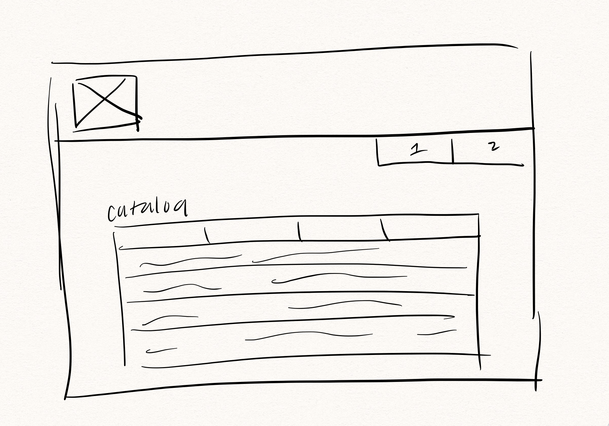
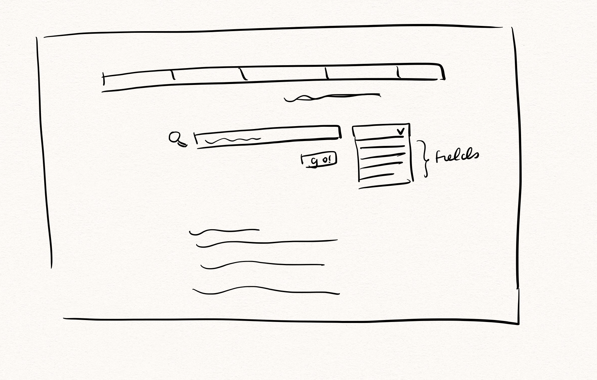
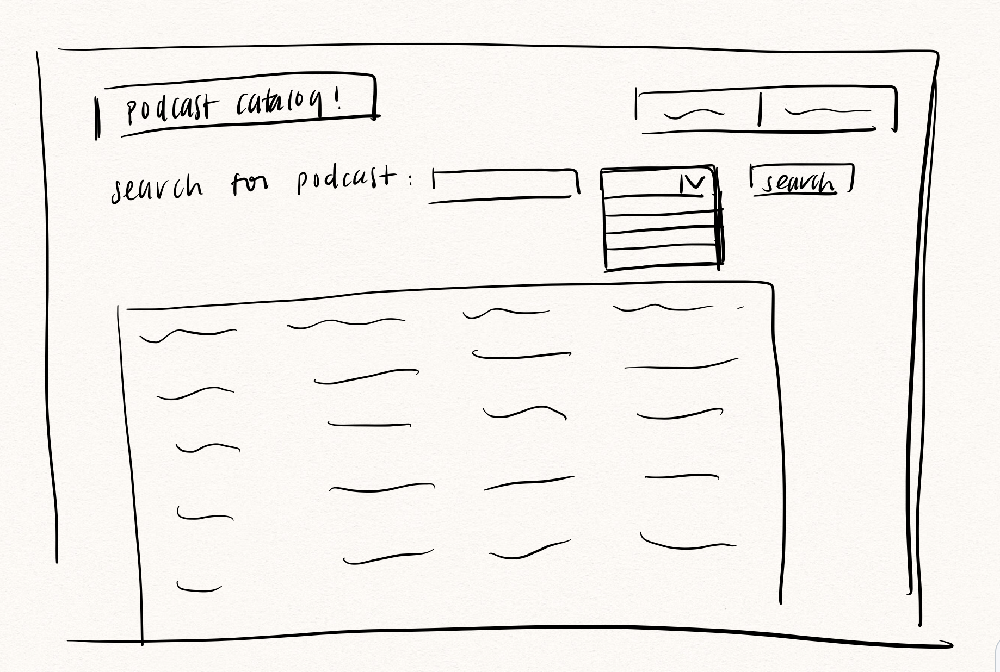
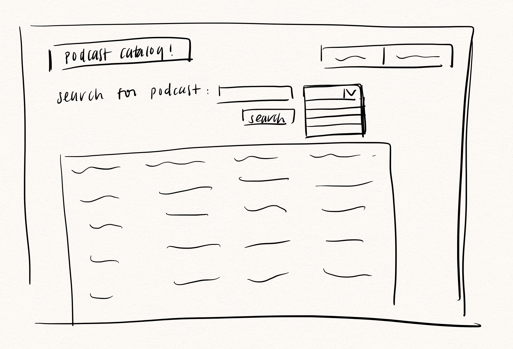
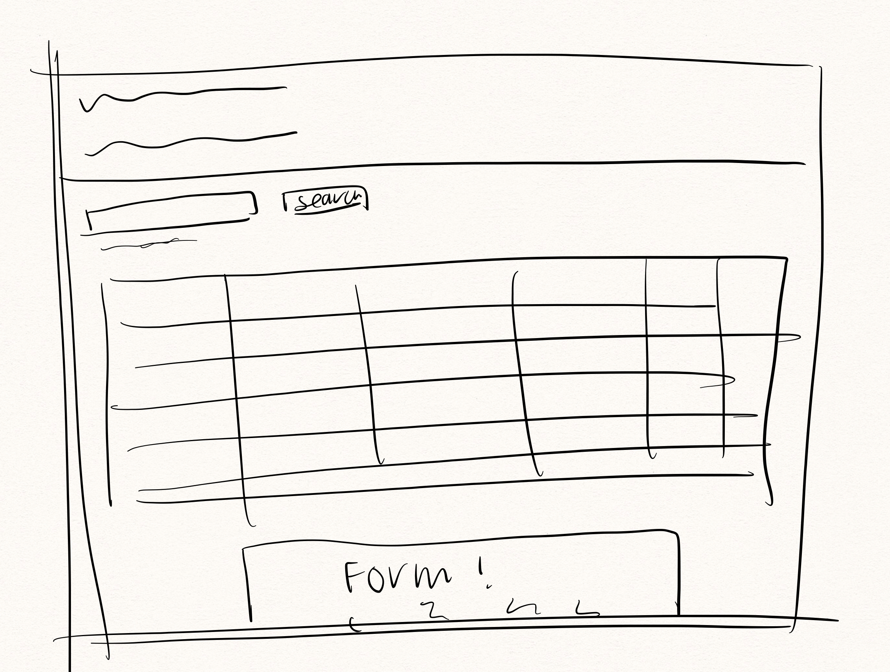
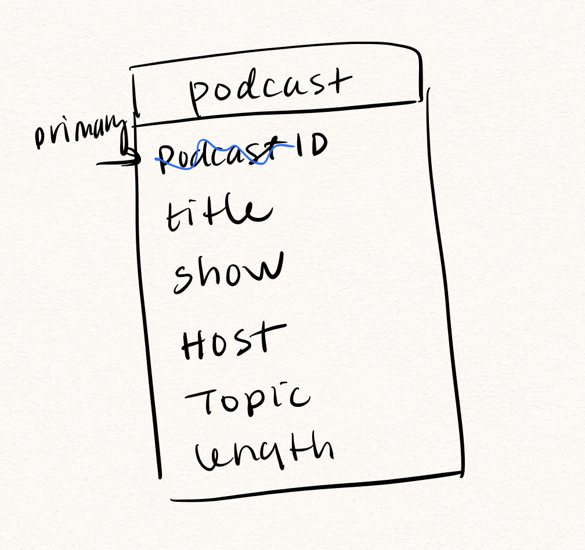

# Project 2: Design Journey

Be clear and concise in your writing. Bullets points are encouraged.

**Everything, including images, must be visible in VS Code's Markdown Preview.** If it's not visible in Markdown Preview, then we won't grade it.

## Catalog (Milestone 1)

### Describe your Catalog (Milestone 1)
> What will your collection be about? What types of attributes will you keep track of for the *things* in your catalog? 1-2 sentences.
The collection will be a podcast catalog, which will include attributes such as Episode title, Show, Host or hosts, Topic, Genre

### Target Audience(s) (Milestone 1)
> Tell us about your target audience(s).
Primary audience will be listeners who are trying to widen their exposure to different podcasts. Specifically, this catalog will strongly appeal to users who are looking for recommendations to become more well-versed on a subject area through podcasts, and would be interested in searching based on the attributes described above.

### Design Patterns (Milestone 1)
> Review some existing catalog that are similar to yours. List the catalog's you reviewed here. Write a small reflection on how you might use the design patterns you identified in your review in your own catalog.
- Apple Podcast
    organized by very clear headlines such as "New & Noteworthy" and "Black History" to reflect the currentness of the selection and bring new material to users attention. This design format made very efficient use of space while conveying a variety of information, which is a great format to apply to my catalog
- Baker Creek
    very cluttered and very overwhelming with the sheer amount of content on page. The text displayed over the images amplified the content of the page, and lack of white space could have attributed to dizzying feel. This site demonstrated importance of dividers to draw attention to certain areas while helping users differentiate between each section. This is definitely very important to keep in mind while designing my catalog, and be cognizant of not overwhelming readers with too much information in a tight amount of space.
- Billboard
    Good balance of content to whitespace, and prioritized the most curated charts that are most universal to users (ie> Hot 100, Billboard 200), as opposed to the more niche genres located in smaller icons at the bottom. This is very eye-catching and also aestethically appealing, a very good goal for my catalog to incorporate.

## Design & Planning (Milestone 2)

## Design Process (Milestone 2)
> Document your design process. Show us the evolution of your design from your first idea (sketch) to design you wish to implement (sketch). Show us the process you used to organize content and plan the navigation, if applicable.
> Label all images. All labels must be visible in VS Code's Markdown Preview.
> Clearly label the final design.

Preliminary sketches

no search fields yet, just focusing on catalog display


includes search function




final iteration, includes all the elements previously experimented with placement of the search button and search fields



final iteration for add form


## Partials (Milestone 2)
> If you have any partials, plan them here.

- heading partial
will display the respective page name for each page

- footer partial
includes hyperlinks to the corresponding social media accounts for the catalog's associated org


## Database Schema (Milestone 2)
> Describe the structure of your database. You may use words or a picture. A bulleted list is probably the simplest way to do this. Make sure you include constraints for each field.

Table: podcast
- field 1: id, primary key, integer, unique identifier
- field 2: title, represents episode title, string, not Null
- field 3: show, represents the podcast name, string, not Null
- field 4: host, can be either one name or a series of names, string, not Null
- field 5: topic, subject area that podcast touches on, string, not Null
- field 6: length, time duration of podcast episode in minutes, integer, not Null

preliminary sketch of db scheme


## Database Query Plan (Milestone 2)
> Plan your database queries. You may use natural language, pseudocode, or SQL.]

1. All records

    ```
    SELECT * from podcast
    ```

2. Search records

    ```
    SELECT *

    Use Where statements and Like to find the key word with variability on each side

    CASE WHEN (user's input matches one of the entries in either of the fields, potentially use an array) THEN (save in a variable called return outlut?) Else (return "sorry, your search did not return any matches at this time") End
    From podcast

    ```

3. Insert record

    ```
    Save user's input
    add record at the end of the database
    return new output
    ```


## Code Planning (Milestone 2)
> Plan any PHP code you'll need here.

when form on index php submits,
new sq variable will only contain the entries that match user's keywords

else, output msg saying no matches were found for user's search

default to display complete catalog


# Reflection (Final Submission)
> Take this time to reflect on what you learned during this assignment. How have you improved since Project 1? What things did you have trouble with?

- I had the time to really develop and refine my CSS knowledge/skill base, which is something I've always wanted to improve on! It was a bit hard to conceptualize connecting the database and modifying it at first, so this has been very gratifying to see the project from start to finish. I was also able to just have better control over coding the functionality and focus on the design aspects of this project, and I also became more comfortable with debuggin on my own which is also something I've wanted to improve on.
